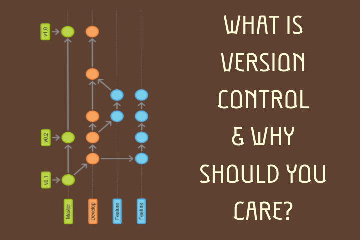

I was working on a project and it was working OK. So, I got a bit of confidence. I tried to refactor the code, tried to add a couple of new features and changed a couple of files. Then when I compiled, build and ran it, it was disastrous. It didn’t work as I expected it to be. Plus, the things that were working before also got messed up. I panicked and I wanted to get to the point in past where all the things were working properly. I hit a couple of undos, tweaked few files but it was too late to avoid chaos.

I wished I had the magic to take a snapshot of the project at any time and I could land onto it whenever I mess up. And someone told me that you totally can by unleashing the power of version control. Yes! you got me right, now you can take snapshots of your project and make the timeline of changes you did, and when you think this change was a stupid idea, go back and travel the timeline. This is called Version Control.

I know everyone has a similar story and has occurred into that kind of problem some place in time. From that point of time, I use a version control system in my every project (you should too) and I have never faced the same problem again. If you’re a developer, no matter what platform or what language, it can be web, mobile, desktop or anything, you should learn a version control system.  I even recommend bloggers and writers to learn it if possible, it would make their writings and creations and would help make revisions of their articles, poems or whatever it is.

I have seen people making a copy of the entire project periodically and renaming it with stupid names. It starts with My project, then My project copy, then My project copy 2 , My project final, My project final last, My project complete, My project 2, My project 99, My project finished.rar and so on with tons of zip and rar files cluttered over the working directory. To all those people out there, please use a version control and control your project versions.

There are a lot of version control systems out there which go by the names git, svn, mercurial and so on. But the most popular nowadays and advanced one is Git and that’s what I use. [Git](http://git-scm.com) is a very advanced tool such that it is easy to learn the basics but it has a lot of options and features which makes it difficult to fully utilize its power without learning it.

> Git is a free and open source distributed version control system designed to handle everything from small to very large projects with speed and efficiency.

By the way, you can learn git from a variety of sources such as [official git website](https://git-scm.com/docs/gittutorial), [learn git](https://try.github.io/).