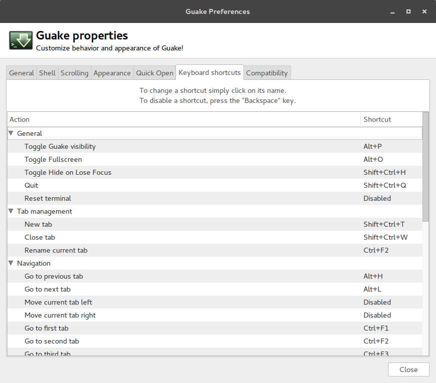
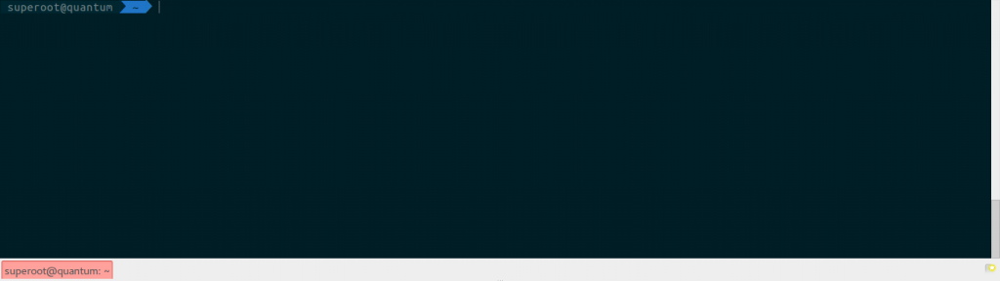

So, let me start off by asking you, how often do you use your terminal? I know everyone who is having Unix based OS, has to deal with it in some point of time. But let me tell you one simple fact.

> Despite of what you think about terminal, you underuse it.

Its the most powerful thing you have in your Linux/Unix Distribution. If you're not using it, or maybe not using it frequently enough, its like using swiss knife to peel off vegetables. You are not unleashing a superpowerful tool.


## Why don't you use it?

*   Its a boring black screen with small white text with jibberish.
*   It takes a long time to type in and remember commands and besides I don't know coding.
*   I don't know any commands whatsoever, why would I use it anyway, when I have GUI.
*   I hate keyboards. I'm more of a mouse guy.
*   I have to fire up my terminal, every time I have to do anything.
*   I don't wanna look like a hacker in front of my friends. :-p

Well, fair enough. Some of the points have a little reality in them. Chances are, you haven't tried to improve and supercharge your terminal to fit in your needs. Having a perfect terminal needs you to customize it and add your custom fine grain controls to actually suit your daily needs. Learning shell and scripting may require some effort from your side, but then you could use it make your computer usage experience much easier and a whole lot exciting. You can do automation, filters, files and string searches and what not. Essentially you will do hours of manual jobs in couple of minutes of innovative scripting automation. Make your daily tasks regulated and the power is enormous.

## Yes, I got it. Show me how?

Alright, lets start by unleashing your terminal.

### Guake

So, Guake is a dropdown terminal which can be pulled down by our favorite hotkey. Mine is ALT+P. Its very handy, I press ALT with my left thumb and P with my little finger, and guess what It will hide with the same key. So, no more opening terminals with Super+T or Ctrl+Alt+T, which will sit on top of applications and have to be manually pushed to interact with other applications. Switching between other apps and terminal becomes super duper easy. Lets install this real quick, open up any terminal:

```
sudo add-apt-repository ppa:webupd8team/unstable
sudo apt-get update
sudo apt-get install guake

```

OK before doing that I wanna tell you that, guake is built only for GNOME and similar linux desktop environments like Unity, Pantheon etc. If you have Mac or maybe linux with other desktop environment like KDE, guake is not gonna work for you. But wait, that's not the end of the world. for KDE, there is YaKuake and Tilda for Mac, there is TotalTerminal(formally known as Visor), although iTerm2 will work just fine(if you don't need that) **Note**: RPM based system have guake too, it will require dnf/yum or whatever your package manager interface is. After you're done with installation, lets configure it:

```
guake-prefs

```

 Assign your keybindings and there you go. Toggle terminal with your favourite key.

### Zsh

We have a new transparent terminal, but we're still in an old shell, i.e. bash. While BaSh is good, there is a much better choice, which is zsh. Essentially Zsh is bash on steroids. It provides extended auto-complete, auto-correct, aliasing, globbing, better look and definitely better experience. I can go on, but this guy has all the best ones listed in a really nice way. [Best Zsh Features](http://code.joejag.com/2014/why-zsh.html) Lets install and set it up real quick:

```
sudo apt-get install zsh git fonts-powerline

```

And to have additional features, we'll have oh-my-zsh. Oh-My-Zsh is an open source, community-driven framework for managing your ZSH configuration.

```
sudo sh -c "$(curl -fsSL https://raw.github.com/robbyrussell/oh-my-zsh/master/tools/install.sh)"

```

If you're ready now, lets change our default shell to zsh

```
chsh -s /bin/zsh

```

It should also affect the guake terminal, but if it doesn't you can change it in `guake-prefs`. Now, we have all the superpowers of fantastic dropdown terminal and a really smart shell. And if you press your fav hotkey now, you should see a beautiful terminal with beautiful colors having multi-tabs and transparency toggle support.  Some people will try to take a deep breath here and try to enjoy with this for a few days before doing any more customizations. But, I just want to all to know that there's lot more we can do, and supercharge our terminal even more, which require more observations about things we hate about our current settings and experimentation with various plugins and scripts. After you've decided to take it a bit further, do make sure to read my next blog post which will reveal more superpowers of this Z shell.