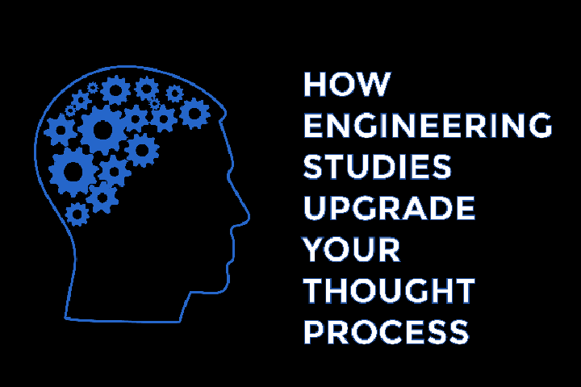

Studying Engineering which was once considered one of the most esteemed disciplines is fading ironically in a world of advancing technology.  Engineering studies are slowly becoming more shadier and less credible in the eyes of most people by time. Mostly due to high number of admissions of disinterested students and presence of substandard colleges. Even though engineering has so much to teach to a student, students often take this for granted. Students start believing that their life is ruined and instead of grasping things which engineering has to offer, they oppose this dramatically in several ways. Cursing the system, making memes at social media, refusing to accept the knowledge, preparing for other non-engineering courses being some of them.

This is one of my efforts to help engineering freshers and aspirants develop a right mindset towards engineering despite of what they hear from dull disinterested losers. Those who hate engineering probably don't understand the notion of engineering or are misguided by hearsay.

One of the most important things that an engineering degree gives you is an intelligence enabled thought process. Your problem solving abilities boost up. You get the ability to devise and use your train of thoughts to synthesize the solution around the problem.

Your scope gets broader. A new world of dimensions and perceptions just show up to you. Suddenly you start noticing minute details and gotchas that everyone thought didn't exist. You know more of the consideration factors for the solution and their impact. You starting weighting parameters more carefully to craft your solution.

Once you acquire the deep knowledge, you start looking at any problem at the root level. When you know everything about the problem you are dealing with and its underlying concepts, then accuracy and efficiency always goes up.

Apart from constructing solutions, you acquire the skill of reverse engineering. Decomposing built products to understand the core and components is an inevitable habit you acquire. More often than ever, you exploit things to suit your needs. Or start tinkering with the core functionality of the things as you please, because you know how it works and how to make it work the other way. You become experts at hacks, and apply your skills to build innovative solution around trivial things.

Engineering has lot more to offer other than teaching a person these perceptive abilities. However, several factors such as demographics, environment, university, resources, person's interest and cognitive ability can make it better or worse. Even though, it is always up to the person to seek, grow and learn what engineering has to offer.

One question holds, "**Are you getting the best of out it?**"