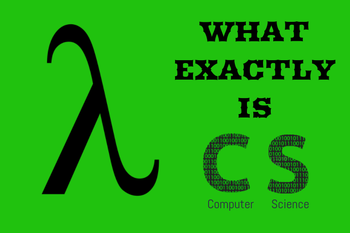

Now, the word computer science is something almost everyone is aware of. It is probably the most popular and most craved branch in engineering. But I think most of the students still don't know what this branch really signifies. Or what does this discipline intend to teach and why?

Most of the students think that programming is computer science. They try hard to excel at web development, app development and learning lots of programming languages. Even when their curriculum doesn't include a lot of things related to development, they curse the whole education system and learn development by other mediums. But really, have you ever thought what computer science actually is?

## So, what exactly is CS?
The name clearly says it all. It's the science of computers and computing.

### Notion of Science
And if there's one thing you should learn from science is the **art of asking questions**. You need to question every single thing and seek an explanation. The **why**s, **how**s, **when**s, **whynot**s, **what**s, **whatif**s about everything is what it's all about.

While we already live happily in nature, eat-sleep-excrete and use a lot of instruments and machines to ease our work, the science focusses on the internals of it. Science takes a deeper approach to studying why that works the way it works and how we came up with such a great invention, what theoretical notion limits its efficiency. Science deals with inventions, theories, concepts, phenomena, workings, changes, reasons, proofs and not just the usage itself. This is also why it is very interesting and sometimes difficult to grasp for ordinary people.

### Foundational Discipline
So clearly, computer science is much more than just programming stuff. It's about understanding the functioning of things bound with computers at all levels. It is about demystifying this thing called computer and knowing fundamentals that lead to its innovation. While most people think the computers kind of work magically, computer scientists actually know that there are bits and pieces(transistors and logic gates) of micro-sized silicon ICs with many other external circuits connected in a very specific manner to make it work. We study foundations of information theory and computational sciences rather than learning specific technologies which come and go. Programming, technology, and development are some of the parts which comprise computer science but not all of it. This fundamental field is a legacy and is way too deeper and older than these newer buzzwords.

## Computer Science: Do you really need it?
Well, if you are IT professional you need to have at least some degree of CS knowledge. You can probably work your way out without having to understand all the concepts. You can be a web or app developer even if don't have a degree. You can build websites that work without having to learn about how it all actually works. 
But, you need to ask yourself this thing first. Is this really how you wanna go about doing this? Doing things you cannot reason about?
You might, though you'll be missing a bunch of capabilities. If you wanna flex your muscles to the maximum, you need knowledge for unexpected breakthroughs and results. You will lack the capability to build out an undiscovered path and make optimal solutions. You can try new ideas that tackle the roots of the problem and try untested waters theoretically and practically. 

For example, to build a beautiful website you can just use drag and drop tools without having any internal knowledge. Now, to make it have better SEO capabilities, cross-browser compatibility, data efficiency, caching, high availability, lesser load time, more security simply having basic web development knowledge isn't enough. That's where the internal knowledge comes handy. We need to understand how the websites actually get served to the browser from a typical web server to actually understand critical areas that need extra improvement. 

While all the things in our curriculum may seem out of place, they are deeply related to information, computing and its origin. Studying these will only give us an insightful info about computers and its working.

## How to make the most out of CS?
Gaining knowledge is never bad no matter what the source is. Academics, books, videos, and magazines have so much you can learn from. You should be going to nearby events such as hackathons, conferences, workshops, competitions, and meetups to get a bigger picture. And most importantly, always keep exploring and find answers to questions your curious mind seeks. Build things and break things, that's how you grow. 