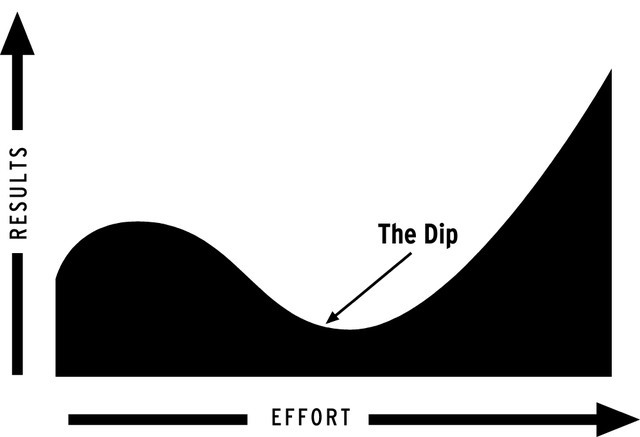
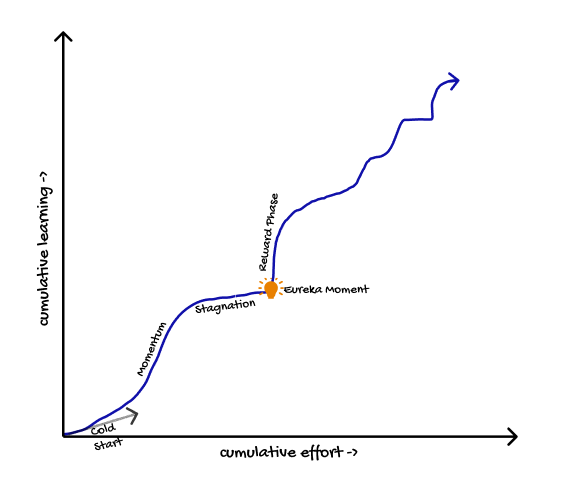
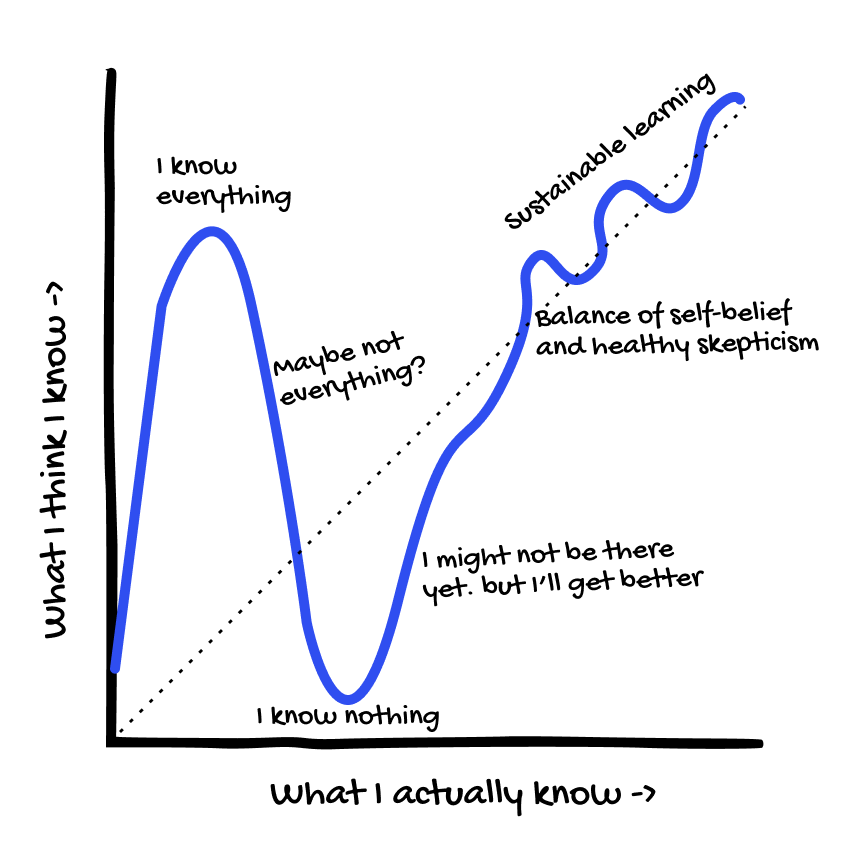
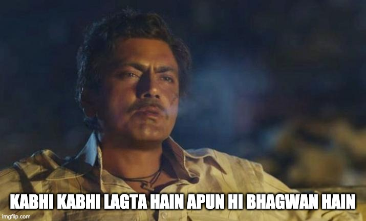
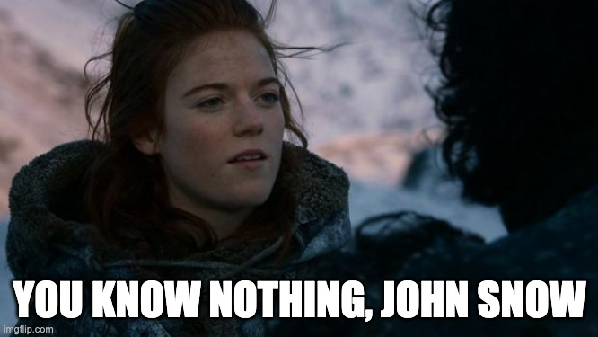
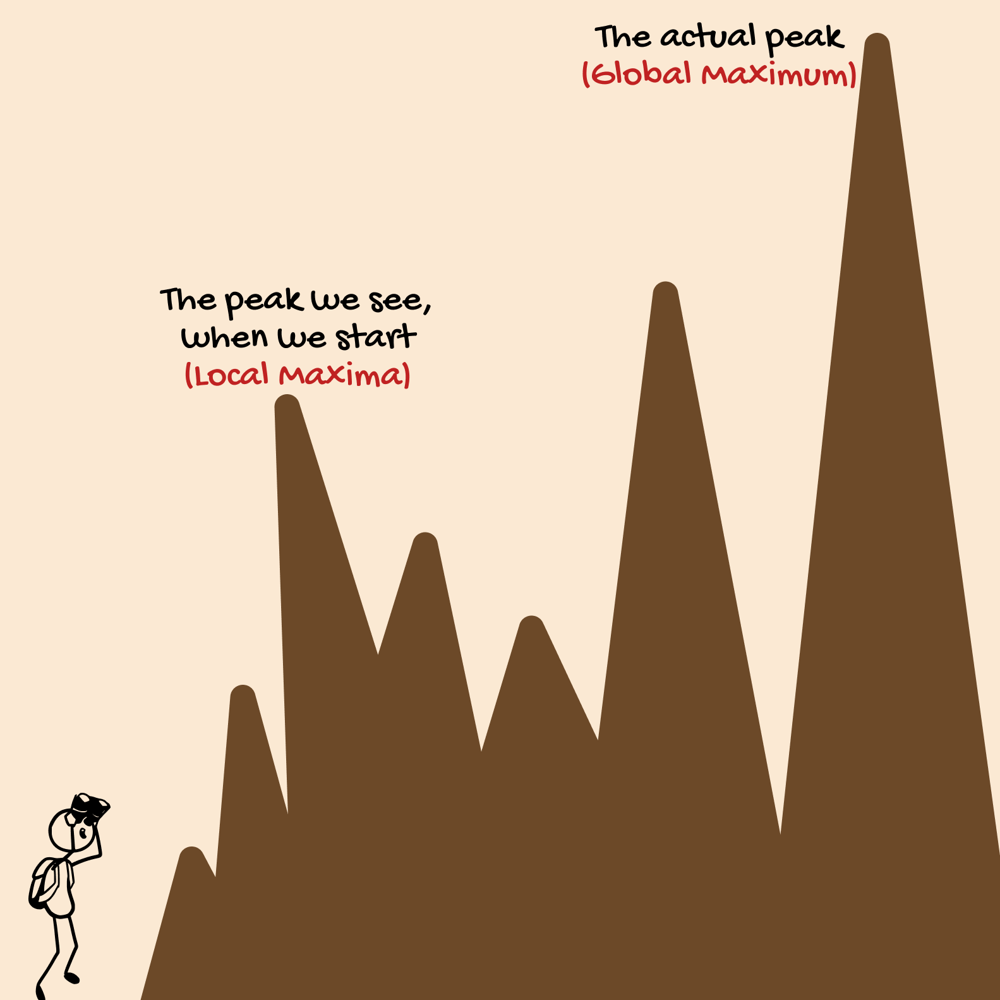
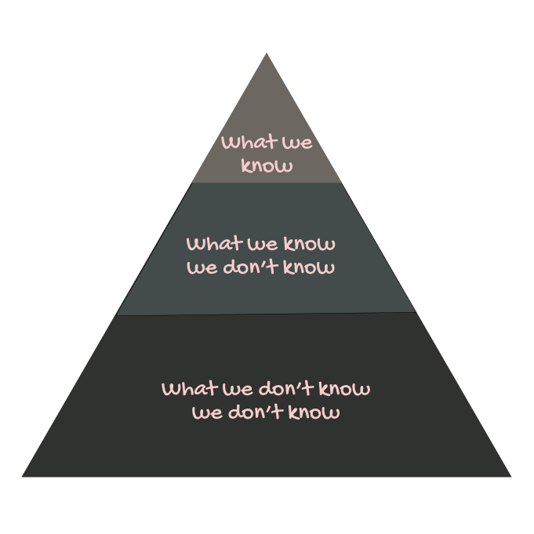

Have you ever felt stagnant while learning something? Have you realized that you might know less than you claim you know after studying more about a subject?
Have you felt that Lightbulb moment while reading a piece of text that just sucked you in into that subject when everything suddenly makes sense?

Well, I have felt all of these things and asked myself dozens of questions of this nature. Over time, I have gained useful insights about learning & human psychology around the same. The mere pursuit of just looking for explanations for some of my feelings has made me more aware and rational about some of the choices I make.

It should not be surprising to think that Grit plays a more important role than IQ for sustainable growth and learning.
This made me write about a few key ideas and assumptions we take regarding the progress of learning.

## A. Progress is Linear

One of the fundamental things to embrace in the process of progress is that "**Progress is not linear**." Failing to acknowledge this is the key reason for discouragement.

In fact, progress can be downwards, trending, or even negative, depending on how you look at it.

### The Dip

Achievement is addictive & can serve as fuel for putting effort into learning. But what if your further efforts don't lead to further achievements? The phase where your efforts seem futile. Can you keep the grind?

Seth Godin terms this as **The Dip**. Anything worthwhile in life actually has some sort of a dip. This phase is the ultimate screening test and makes a majority of people quit. I call it the slogging phase, which separates beginners and masters.

It takes perseverance to continue putting in the work and passion for keeping up the motivation while doing so.

### Aha Moment & Exponential Rewards

Half of the self-help industry is selling the idea of finding motivation during hard times through varying narratives. Since it is easy when you see the results, but if you can cross the chasm, sustain through the dip and come out on another side, you've just understood one of the biggest fallacies of human misjudgment.

In the pathway to learning, continuous learning mixed with curious pondering can be very rewarding & make things interesting. There is a special joy when something just clicks in my head, and a lightbulb just lits up. My brain suddenly joined dots between some concepts I knew but hardly understood. This epiphany which feeds my thirst for curiosity, is what I learn for. This is also called Eureka Effect. This is basically the exponential rewarding part where whatever I have learned over weeks is finally being materialized.

## B. I'm the GOAT or an imposter

Your perception plays a major role in providing you motivation for sustaining the efforts. And it's worth mentioning that your perceived knowledge can vary dramatically from your actual knowledge.
When that difference widens, we witness various irrational effects.

### Apun hi Bhagwan h Effect

When progress is coming easy, confidence often turns into over-confidence. After it doesn't take long before that turns to ignorance and arrogance. We all have come across such people who claim that they know it all. Without reflection & constructive criticism, people may live in a bubble. Moreover, it stops the growth of knowledge as an over-confident person doesn't seek more knowledge.

> "Ignorance more frequently begets confidence than does knowledge." - **Charles Darwin**

Thinking you know something without actually knowing can cause you to make bad decisions. This is a cognitive bias called the [Dunning-Kruger effect](https://www.wikiwand.com/en/Dunning%E2%80%93Kruger_effect). I call it the **Apun Hi Bhagwan H** effect (Translation: I'm the god effect).

So what happens when this person faces moments of reality check?
If that person's arrogance levels are at their peak, chances are he/she won't accept it. But if reality check hits hard, it can drain that person's self-esteem.

### Feeling like an Imposter?

When reality slaps your confidence levels, it is a human tendency to take things out of proportion.

Almost everyone goes through a phase where they think everything that's happening to them is pure luck, and they don't deserve this. This is called the [Imposter syndrome](https://www.wikiwand.com/en/Impostor_syndrome).

When I got a new job, the feeling that I am not as good as they thought I am kicked in. Just because I answered a few questions does not mean I know actual stuff; what if my innocence gets exposed. This feeling is daunting and embarrassing. But, it took just a few weeks of a bargain to understand that, you know what, I know a lot of things, and I don't know a lot of them, and people who I thought were really smart didn't know a lot of things as well, and they are learning as well, so might as well accept that and start learning.

Like over-confidence, low confidence can also make progress slower. It is important to have a [rational optimistic](https://www.rationaloptimist.com/) mindset.

## C. If I learn this, I'll be the master of X.

Ever thought that you can master a topic in X days and later realized that it may take decades to do? We do this dramatic underestimation all the time.
I call it the **curse of local maxima**.

Imagine setting a goal to climb on top of the hill. So, you take a glance at the hill and say this seems easy and start climbing. You are all pumped up, seeing the point coming closer and closer. But halfway through, you realize that there are higher peaks in the hill range that you set out to climb. You could only see those higher peaks once you crossed a certain height. Now, that is shock and excitement disguised into one. You now know that you can go even higher if you wanted to, but are also disappointed since you thought you were this close to reaching the peak.

This is what I call the **curse of local maxima.** The point you think is the global maxima turns out to be only a local maximum which lets you see other maxima higher than the current one. This is very similar to [Hill climbing problem](https://www.wikiwand.com/en/Hill_climbing) in AI and Mathematics.

Your sight can only see peaks that are in your range and perception. Each time you reach a peak, you unlock a greater range & see higher peaks than the current one. This creates a constant cycle of achievement and disappointment which can become overwhelming. If this happens to you a couple of times, the best-case scenario is when you fall in love with climbing new hills. Or you could start hating the process for become so overwhelming and never climb again.

Moreover, when you reach a peak, you realize that there are not one but dozens of other peaks which are worth climbing. While you could theoretically climb all of them if you had all the time in the world, but you know that you have to focus your efforts on climbing peaks which would most likely lead you to your definition of accomplishment. You would initially think that you're lucky to have so many choices, but it can quickly become overwhelming knowing you have limited energy.

This is called the Paradox of choice. I strongly recommend watching this Ted talk: [Barry Schwartz - Paradox of Choice](https://www.ted.com/talks/barry_schwartz_the_paradox_of_choice?language=en)

This analogy applies perfectly to gaining knowledge. You start studying general science; when you think you got the fundamentals, you realize there are dozens of branches of science. Then when you pick physics and get a surface-level understanding of the fundamentals of physics, you realize that there are dozens of branches of physics and thousands of fields that can be researched upon. Your brain starts imploding with the realization that there is a lot of things you don't know and won't be able to learn.
There is a greater range and greater depth in every field than you can possibly imagine. Our mind can only map so much as we can only explore so much. This is called Bounded understanding.

So, it is important to acknowledge that you might not know everything about a subject. Admitting when you don't know the answer to something instead of guessing is a great sign of humility. Having an awareness of whether I understand this or merely know the name can save misjudgment & unlocks learning opportunities.

> There is a difference between knowing the name of something and knowing something. - Richard Feynman

Embrace the idea of infinite possibilities and start loving the process.

## References

* [Knowledge - Breadth vs Depth](http://nealford.com/memeagora/2015/09/08/knowledge-breadth-versus-depth.html)
* [Dunning-Kruger effect](https://www.verywellmind.com/an-overview-of-the-dunning-kruger-effect-4160740#:~:text=The%20Dunning%2DKruger%20effect%20is,to%20recognize%20their%20own%20incompetence).
* [Why incompetent people think they're amazing - David Dunning](https://www.youtube.com/watch?v=pOLmD_WVY-E)
* [Seth Godin - The Dip](https://www.goodreads.com/book/show/324748.The_Dip)
* [TED Talk: Barry Schwartz - Paradox of Choice](https://www.ted.com/talks/barry_schwartz_the_paradox_of_choice?language=en)
* [Learning How to Learn | Barbara Oakley](https://www.youtube.com/watch?v=vd2dtkMINIw)