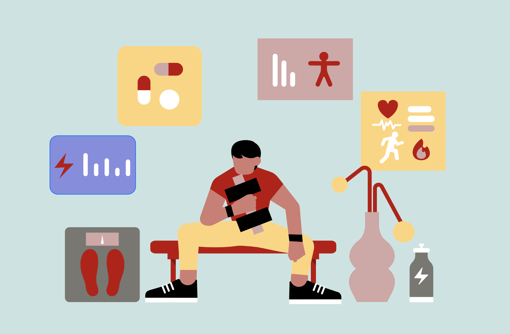
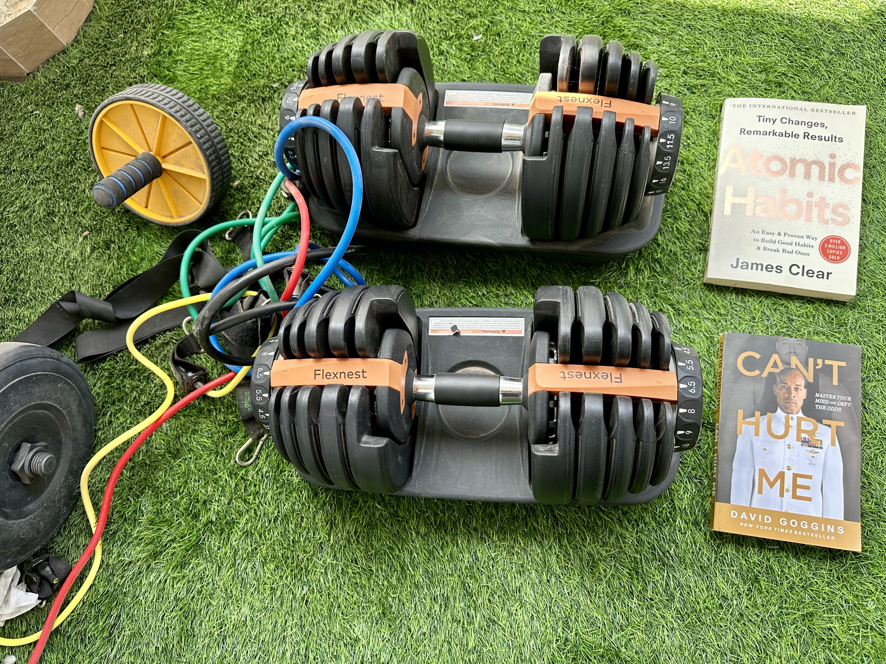
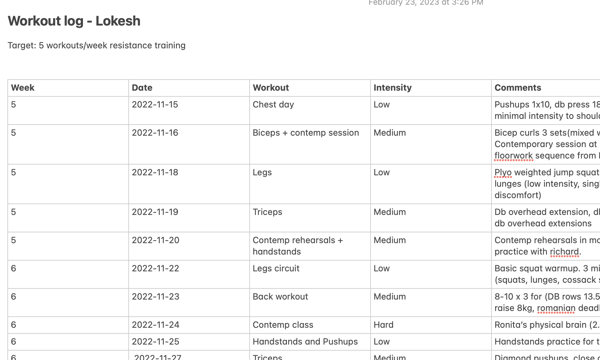
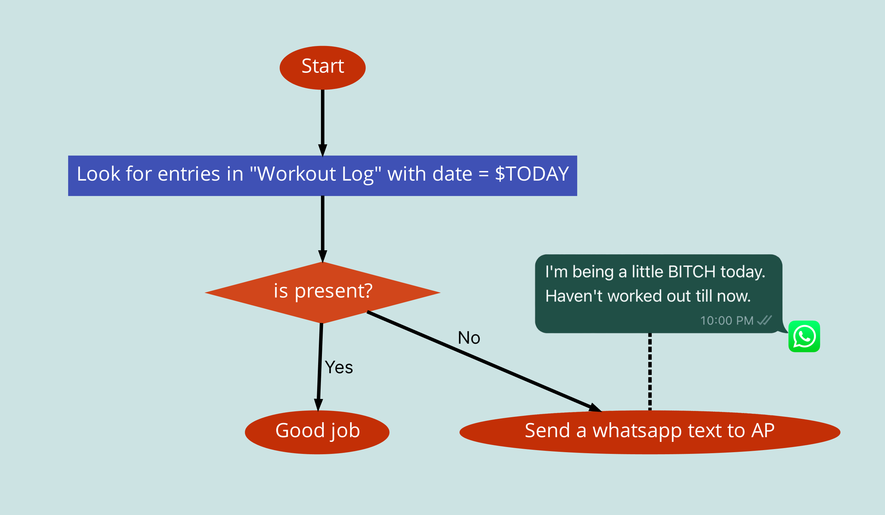
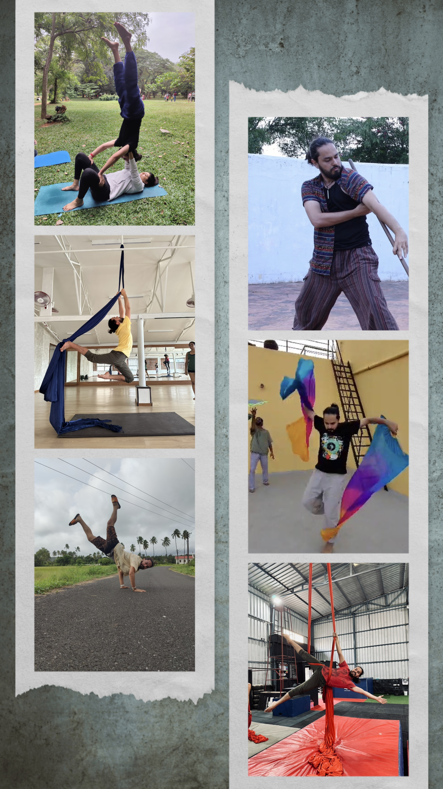
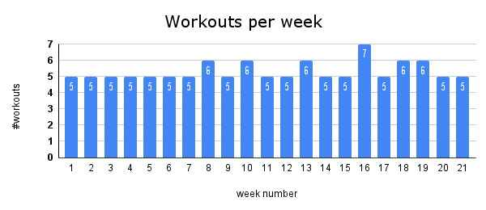

Resolutions, targets, goals! We all make them, right? Maybe you want to get rid of that pandemic belly or want to learn that new skill. It is all motivation and enthusiasm until life happens. And surprisingly, or not so surprisingly you fell off track and convinced yourself why you don’t want to strive for it. Or come up with a creative excuse for why you didn’t do it today and why starting tomorrow is better.

## Why do I not stick to my goals?

That’s an interesting question to ponder on. Let’s dig.

Alright, let's talk about excuses. Maybe you forgot to do your homework, so you tell your teacher your dog ate it. Or maybe you didn't feel like going to the gym, so you tell yourself you'll start tomorrow (but we all know how that goes).

But here's the thing: We're all creative individuals when it comes to making excuses. We have a defense mechanism that kicks in when we feel challenged or threatened, and making excuses is a natural way to protect ourselves. A well-crafted excuse and a genuine reason are indistinguishable from each other. Funnily enough, even you can’t distinguish it despite having a great level of self-awareness. 

We’re too smart for our good. Often prioritizing instant gratification over daily improvement despite knowing the concept of compounding, the eighth wonder of the world. 

The aftereffects are not pleasant and often come with guilt. This can be explained by cognitive dissonance theory.  

> Cognitive dissonance theory postulates that an underlying psychological tension is created when an individual’s behavior is inconsistent with his or her thoughts and beliefs.
> 

The inconsistency creates a state of discomfort, which motivates the person to reduce or eliminate the dissonance by changing their beliefs, attitudes, or behaviors. How do we do that?

By rationalizing our not-so-perfect choices (aka creative excuses) or by carefully cherry-picking arguments that support our choices (aka confirmation bias), or avoiding the topic altogether (aka lack of ownership) 

Eg. You're trying to lose weight. You understand that diet plays the most important role in the process, but you just can't resist that DBC ice cream from Corner House. So, what do you do? You convince yourself that eating the cake is helping you lose weight because you'll feel happier and therefore more motivated to exercise. Lol, right. 

Sometimes you get this sudden burst of motivation. Perhaps you just watched the infamous **["Just Do It"](https://www.youtube.com/watch?v=ZXsQAXx_ao0)** by Shia LaBeouf. So you address cognitive dissonance by fixing your actions and aligning it with your beliefs. Before you know it, motivation has worn off and you’re back to square one.

I was in the same boat. Working on the goals only when I felt motivated and had time for it. While I was still progressing, I knew I could do better. So, what changed? 

## The holy grail of self-help books

My journey took a pivotal turn when I stumbled upon two life-changing self-help books. These weren’t just reads; they were revelations that reshaped my thinking. 

Reflecting on them, I could not only identify patterns in my life but also actionable steps to address them.

From atomic habits, I had a couple of realizations:

- I figured that I needed to focus on a process and a system rather than a goal. The system should have clear rules with no ambiguity. Any ambiguity can give rise to creative excuses - *so I came up with my weekly targets and rules.*
- I need to track my habits on a persistent system to measure my progress - *so I created a shared IOS note and started tracking.*
- Having an accountability partner greatly increases the odds of you sticking - *so I asked a friend to hold me accountable.*
- Reduce the friction to repeat the habit - *so I invested in revamping my workout space.*

From Can’t hurt me, I learned

- To run my race and not let other’s reality be my reality - I set myself realistic goals taking my circumstances, privileges, unfair disadvantages, and priorities in account.
- Self-honesty - It encouraged me to confront and accept my past failures, taking full ownership of my actions and inactions, both past and future.
- To callous my Mind by Making Uncomfortable Choices - Inspired by David Goggins' story, I decided to embrace discomfort and stick to my goals regardless of the situation - be it traveling, illness, or fatigue. The idea was to scale up or down as needed, but NEVER SKIP.

## Laying the foundation, realization to action

Embarking on this journey, I realized I needed more than just motivation; I needed a solid accountability system. So, I crafted one tailored just for me.

Rules - 

- I’ll resistance train at least 5 days a week.
- Exceeding the 5-day quota won't roll over to the next week – nor can I play catch-up the following week.
- Variety is the spice of life! Mix up the workouts - be it calisthenics, weight training, or even surfing. The key is to keep it fun and within the guidelines.

I intentionally avoided setting a Herculean goal. Instead, I chose something flexible yet challenging. The aim? To steer clear of setting myself up for failure and a potential downward spiral.

Now I needed a system to record my habits. As a heavy note user, I decided to utilize the same.

### ****Harnessing iOS Notes for Habit Tracking****

To keep tabs on my habits, I turned to my trusty iOS [notes](https://apps.apple.com/us/app/notes/id1110145109). Why? 

- Minimalist, native, fast, and accessible on all my machines even without the internet.
- Can be shared with an accountability partner. Zero learning curve for AP. Notifies on edit.

This time, I approached my process with clarity, conciseness, and a dose of realism. The thought of my accountability partner monitoring my progress was a strong motivator to stay consistent with my workouts. 

Five weeks in, and I hadn’t missed a beat - definitely a moment for a 'pat on the back' for myself!

But now I wanted to make sure it stays this way. What if I slipped up? What if I forgot a workout day?

Activating my hacker mode, I was programming on my iPhone this time. Did I tell you, no code was involved.

## ****Crafting an Accountability Alerter****

As a software engineer, I know the power of timely alerts. Just as AlertManager complements PrometheusDB in monitoring, we can have an alerting mechanism alongside iOS notes.

What if that alerting mechanism can be built with an app we all have in our iPhones natively, but probably never use? 

### **Unveiling iOS Shortcuts**

Think of the Shortcuts app as your iPhone’s superhero or a no-code/low-code way of scripting on iOS. It automates tasks with a single command, transforming complex actions into simple ones. These shortcuts are so intuitive, you'll wonder how you managed without them. They come pre-installed on devices running iOS 13 or later, ready to simplify your life.

### Putting it into action

I created a workflow: if I haven't logged a workout by 10 PM, it automatically texts my accountability partner. 

I've even shared it for you to adapt and use: [https://www.icloud.com/shortcuts/6307504a84404391a982217fb458cbd3](https://www.icloud.com/shortcuts/6307504a84404391a982217fb458cbd3)

**Note:** Make sure you update contact of your accountability partner here.

### Results

For 21 weeks, I consistently logged at least 5 workouts weekly. Despite travel, minor injuries, and social commitments, I stuck to my plan.

Lethargy or lack of time? A quick 10-minute workout with burpees and pushups. No equipment? Plyo squats, lunges, and pushups. An elbow injury? Bodyweight exercises. And when something new and challenging came up, I dove in. I tried yoga, aerial silk, capoeira, acroyoga, contemporary dance, butoh, running just to name a few.

This journey wasn't just about physical fitness. It was a transformative experience that boosted my energy levels - a significant win given my hypothyroidism. It wasn’t about tracking macros but making mindful eating choices.

The biggest gains were mental. This journey dissolved my self-doubt, bolstering my self-confidence and belief in my capabilities. It became a blueprint for tackling tough challenges, staying consistent, and ticking off to-do lists. It shaped a new, resilient me.

More goals are on the horizon, but that's a story for another blog post.

## Conclusion

Sometimes, your willpower needs a backup. Combining the right mindset, inspired by my favorite books, with a well-structured process makes falling off the wagon a lot harder.

When you put together the right tools and right advice, it's not just about hitting your goals. It's also about quieting those nagging doubts in your head, making the whole journey a lot smoother and more doable.