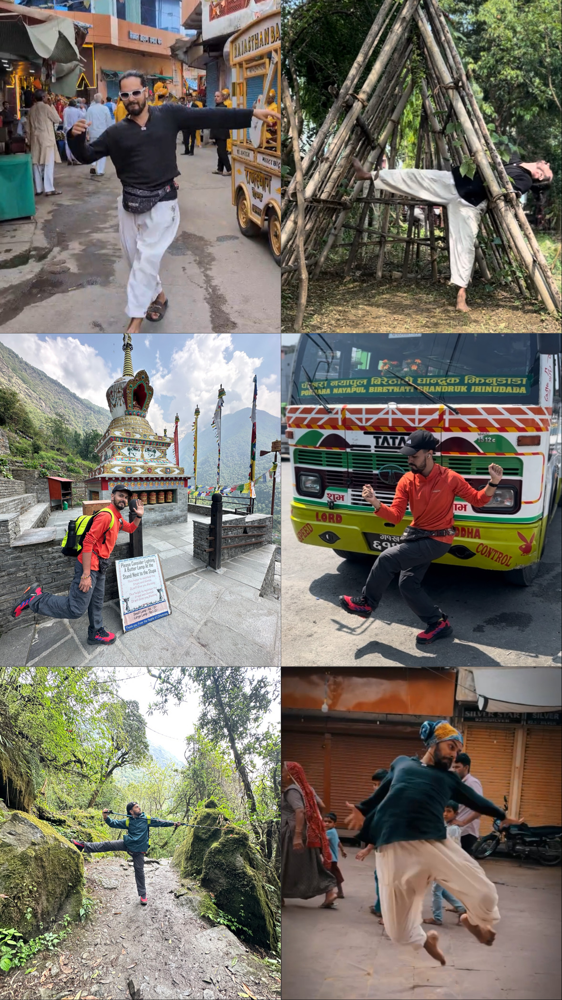

For thirty days, I danced in places I never planned for: alleys where the air smelled of incense and smoke, rooftops under sharp sun, streets buzzing with eyes that wouldn’t look away.

It felt stubborn, almost stupid at times. But I wanted to let sensations pierce me instead of pass me by, trusting they would shape something honest in my movement.

It tested everything - my adaptability, my discipline, my courage in public, my ability to make something out of nothing. And some days, that meant facing parts of myself I’d rather have hidden. Turns out a month without walls can teach more than years inside them.

> *"I'm not dancing for success. Success is that I'm dancing."* **— Franky Dee**

Words feel shallow compared to what I embodied. But I’ll try anyway, hoping it might inspire someone to begin.

## **Why I Turned 30 Days of Travel Into a Stage**

Travel was calling: the ancient lanes of Kashi, the mountains of Nepal, my hometown Ajmer. New backdrops every day, but no studio, no rehearsals, no classes. The usual training rhythm was gone, and I didn’t want my practice to fade.

So I set myself a challenge. Could I keep my practice alive, even grow it, while hopping from city streets to mountain trails to riversides? Could I commit to moving every single day, no matter how tired or uninspired I felt?

I’ve always loved movement improvisation, so I combined it with my travels. Every place became a stage. Every moment a prompt. I adapted to whatever was around: a suspension bridge, a quiet ghat, a noisy street. I also considered how the camera could join the piece.

To keep myself honest, I put it all online. If the world was going to be my studio, it could also be my witness.

That’s how thirty days of movement began, in places I never planned for and moments I couldn’t have made up.

## Stories the Spaces Gave Me

> “Wherever a dancer stands is holy ground.” — Martha Graham

From the ghats of Varanasi to a bamboo village high in the Himalayas, each place pulled something different out of me.

In Pokhara by the lake, I’d just started moving when two kids rolled up, giggling like they’d caught me doing something funny. First they copied my arms, all clumsy and shy. Then, out of nowhere, they went full on. No hesitation. I couldn’t resist, so I showed them a couple of hip-hop grooves and a body wave, hyped them every time they gave it a shot. Soon the camera was rolling and the three of us were just dancing together. That clip still makes me smile.

At a quieter ghat in Varanasi, I was deep in my improv when this guy just drifted in, like he’d been waiting for the signal. No hello, no eye contact - he started throwing in a few moves, then looked at me and added shayari with gestures once he noticed the camera. His grin said it all. We never spoke, never swapped names. Didn’t matter. That jam spoke for itself.

I also danced in Pushkar’s crowded lanes to a sad song while cows and scooters passed by.  
I mixed waving with contemporary in the middle of a baarat while the drums were blasting.  
I danced at a half-built construction site, moving through the wooden frames.  
I danced at Machapuchare Base Camp, short of breath, with a heavy body in my hiking gear.

And then there were the random spots like bus stops, rooftops, balconies, mountain trails at 4,000 meters, bamboo villages after long descents, footpaths, hostel staircases, temple courtyards, parks, alleys, cafe lawns, even a suspension bridge that wouldn’t stop swaying.

People responded in all kinds of ways: cheering me on, asking for selfies, ignoring me, joining in, asking me to teach, or telling me to leave.

Other days it was the mind. The pull to quit when inspiration lagged. The heat of too many eyes watching. The doubt of whether a take was worth sharing.  
Sometimes the spaces themselves tested me: slick floors, uneven ground, cramped balconies, nowhere to keep a tripod, each one daring me to adapt or walk away.

## **What Showing Up Taught Me**

1. **Social Energy**
    
    Usually, when I’m in pure consumption mode, social media is just dopamine hits and then that empty scroll feeling. But this was different. When I started posting every day, people didn’t just watch - they responded. Some messaged me like, “*I haven’t had time for a class or a studio, but your reel made me dance in my bedroom today.*” Others started sharing ideas with me - like, “*yo, you should try moving on this song*” or “*The way you played with those bamboo sticks was crazy. You should try more of that*.” That gave me the fuel on days I would’ve stopped.
    
2. **Start Before You’re Ready**  
    There were days I felt heavy, not in the mood to move. You know that feeling when your body just doesn’t want to start? Normally, I’d put it off. But during this challenge, I forced myself to just set the tripod, hit record, and see what came out. And strangely, some of my favorite videos were born on those “lazy” days.
    
    Like once in my hostel - late morning, running on messed-up sleep, totally unmotivated. I plopped down on the staircase, hit record, and started moving with zero plan. 15 minutes later, I was lost in the music, playing with hand styles and musicality, all while staying seated, butt glued to the step. And it turned into one of my favorite pieces. If I had waited for the “perfect mood,” that moment would’ve never happened.
    
3. **Attunement to State**  
    I used to walk into a session trying to decide the mood - “Today I’ll go high energy with sharp movement quality.” Trying to boss my body around. But my body didn’t always agree. Some days, it just wanted to melt instead of punch. I fought that at first, but once I started listening, things changed. It wasn’t laziness - it was my body telling me where to go: some days fire, some days water. And funny enough, the days I let it lead ended up being the most satisfying and visually most appealing.
    
    My mind–body connection sharpened like anything.
    
4. **Space as Collaborator**
    
    > *"Be like water making its way through cracks."* **— Bruce Lee**
    
    By the end, I wasn’t just finding spots to dance. The world stopped being a backdrop and became my prop, my playground, my collaborator.
    
    In contemporary dance, we talk about space as a partner - not passive, but responsive. I lived that every day. A staircase became a prop. A pillar, a partner. A rope bridge, an unstable bouncy floor. A wet balcony after rain, a stage. A bus stop railing, my support for tricks. After 30 days, I no longer needed four walls, a mirror, or the “right” floor. The studio now lives in the curve of a staircase, the echo of an alley, and wherever I am.
    
5. **Vulnerability as Freedom**
    
    > *"You can't get to courage without walking through vulnerability."* **— Brené Brown**
    
    You know what was harder than dancing? Posting it. Every. Damn. Day.
    
    There were plenty of nights I thought, *“This is trash, why am I putting this up?”* My instinct was to delete and move on.  
    Not just the movement - the words too. I was writing what I felt every night, trying to make sense of it in sentences. And honestly, some days felt scarier than the movement. Because once it’s out there, people don’t just see you, they *read you.*
    
    The freedom wasn’t in nailing the moves = it was in saying, *“Yeah, this is what I’ve got today. Messy, awkward, whatever.”* Once I stopped hiding the bad days, I stopped fearing them. And that’s when dancing (and sharing) felt lighter.
    
6. **Spontaneity as Skill**  
    We romanticize spontaneity as pure instinct. But the truth is, it’s a trained capacity, built from years of embodied vocabulary, of showing up even when inspiration doesn’t strike.
    
    Each day was a dialogue between my body, my mood, and the space around me. I couldn’t control the weather, the crowd, or the noise. But I could choose how to move within it. That choice, that agency in uncertainty, is improvisation for me.
    
    Turns out, spontaneity isn’t magic. It’s a muscle. The more I threw myself into random situations, the quicker I could make something out of nothing.
    
7. **Discipline Unlocks Play**
    
    > *"We are what we repeatedly do. Excellence, then, is not an act, but a habit."* **— Will Durant**
    
    The irony? Discipline didn’t kill the fun - it unlocked it. Showing up every single day meant I couldn’t obsess over whether the video was “good.” Some days I was sore after a long trek, other days stuck on a tiny balcony with barely enough space. I still moved. And because I had no choice, the perfectionism slowly peeled away.
    
    That’s when I realized: discipline and play aren’t opposites. They’re the same thread. The daily structure stripped away the excuses, and once the need for perfect conditions dissolved, freedom walked right in.
    
8. **Comfort with Being Seen**
    
    > *"Expose yourself to your deepest fear; after that, fear has no power."* **— Jim Morrison**
    
    Most people know the feeling: doing something that makes you stand out, catching a few too many eyes, feeling like the room has quietly turned to watch. The mind spins: Do I look strange? Am I doing this wrong? What are they thinking?  
    I felt that too, in Pushkar’s crowded streets, on the ghats of Varanasi, even in a baarat with drums thundering. At first, every glance felt like a weight. But each time I stayed with the movement, past those first tense seconds, something shifted. The stares became background noise, the space felt mine, and I stopped translating attention as judgment.  
    It’s not that the feeling is gone; it still flickers up. But after experimenting in so many places, I’ve embodied the sense that it’s not a danger. I can relax into being seen. I don’t brace against visibility anymore; I allow it. Not for approval, but to stand in my own presence without apology. A confidence I now carry into rooms, conversations, and moments of uncertainty, knowing I can hold my ground in full view.
    

## **Closing**

Thirty days outside the studio changed more than my practice. It shifted how I see space, meet discomfort, and show up. The places will blur, but the habit of moving, ready or not, feels permanent.

What began as a way to keep my practice alive while traveling became a deeper experiment in commitment, adaptability, and presence.  
The challenge is done, but the thread is still pulling me forward. The world is my studio now. And I’ll keep moving through it.